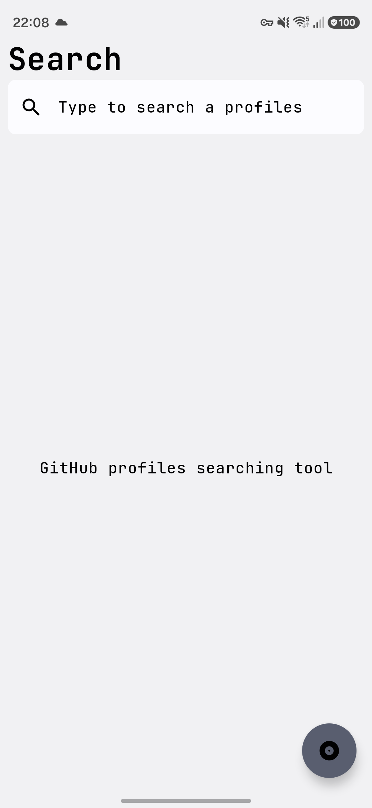
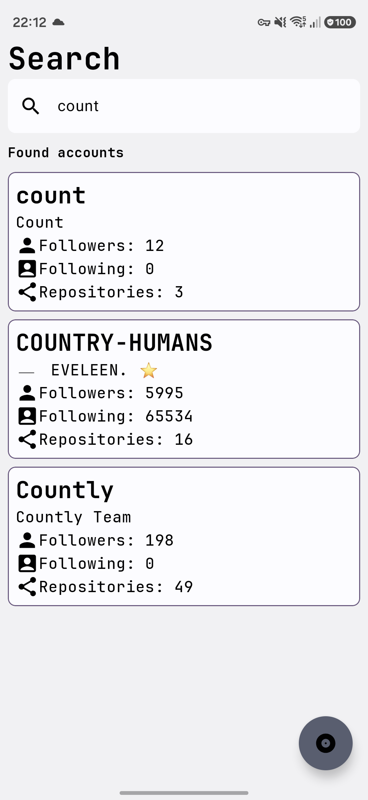

# The GitProfileView application

### About
The application allows you to search GitHub profiles and their repositories

### Key features:
- A search page with a search bar (easy to use, no buttons, there are debounce tactic to handle user search request)
- Open profile in browser at [github.com](https://github.com)
- Visited profiles history
- Dark & Light theme

### Plans & Future
- To add GitVerse support
- In-app profile view screen
- GitHub package
- Automatic tests and pipeline

### Screenshots
A main screen  
  

Found profiles   

Visited profiles

